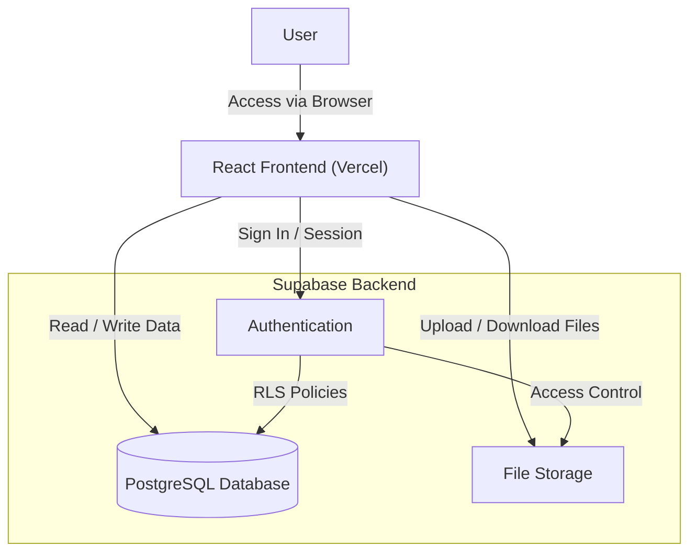

# Resource Hub

Resource Hub is a modern, centralized web application designed to capture, organize, and store your digital resources. Whether it's web links, PDF documents, images, or audio files, Resource Hub provides a seamless interface to keep everything in one place, accessible across your devices.

## 🚀 Features

### 🔐 Authentication & User Profile
*   **Secure Sign-In**: Login securely using your Google account (powered by Supabase Auth).
*   **Profile Management**: View your avatar and name in the header. Hover over your name to see your registered email address.
*   **Data Privacy**: All resources and categories are private and scoped to your user account using Row Level Security (RLS).

### 📥 Resource Capture
*   **Support for Multiple Types**:
    *   **Links**: Save URLs to articles, videos, or websites.
    *   **Files**: Upload documents (PDFs), images, and audio files directly to secure cloud storage.
*   **Rich Metadata**: Add titles and detailed descriptions to every resource for better context.
*   **Categorization**: Tag resources with custom categories during creation.

### 📋 Smart Feed & Discovery
*   **Dashboard Overview**: Get a quick snapshot of your collection with stats on total resources and categories.
*   **Dynamic Feed**: View your resources in a clean, card-based layout with visual badges for file types (PDF, Link, Image).
*   **Search**: Instantly find resources by typing keywords found in their titles or descriptions.
*   **Filtering**: Drill down into specific topics using the category dropdown filter.
*   **Sorting**: Toggle between "Newest" and "Oldest" to manage your viewing order.

### 📂 Organization
*   **Category Manager**: Create, manage, and delete custom categories to keep your library organized the way you want it.

## 🛠️ Tech Stack

*   **Frontend**: React (Vite)
*   **Styling**: Modern CSS3 with HSL variables, Dark Mode aesthetics, and Glassmorphism effects.
*   **Backend**: Supabase (PostgreSQL)
*   **Authentication**: Supabase Auth (OAuth)
*   **Storage**: Supabase Storage Buckets
*   **Deployment**: Vercel

## 🏗️ Architecture



## 📦 Setup & Installation

1.  **Clone the repository**
    ```bash
    git clone https://github.com/nithindd/ResourceHub.git
    cd ResourceHub
    ```

2.  **Install Dependencies**
    ```bash
    npm install
    ```

3.  **Environment Configuration**
    Create a `.env` file in the root directory with your Supabase credentials:
    ```env
    VITE_SUPABASE_URL=your_supabase_project_url
    VITE_SUPABASE_ANON_KEY=your_supabase_anon_key
    ```

4.  **Run Locally**
    ```bash
    npm run dev
    ```

## 🌍 Deployment

This project is optimized for deployment on [Vercel](https://vercel.com).
Simply import the repository, adding your `VITE_SUPABASE_URL` and `VITE_SUPABASE_ANON_KEY` as Environment Variables in the Vercel dashboard.
